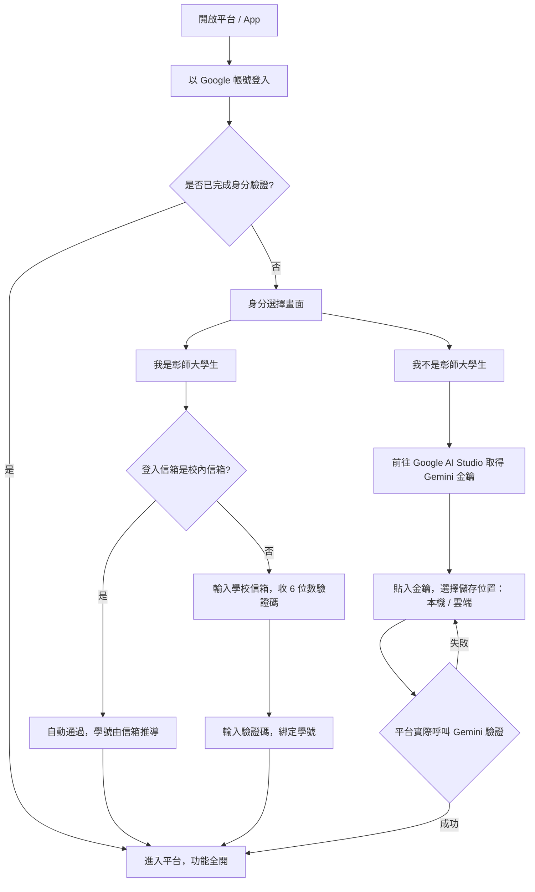
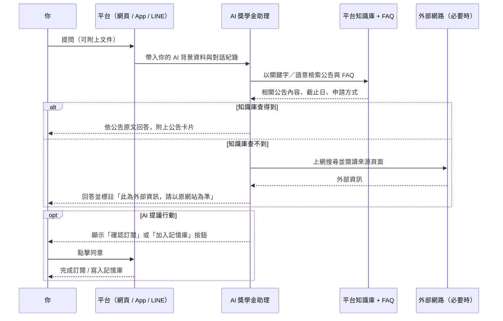
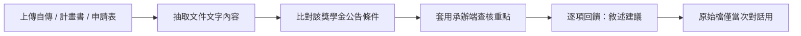
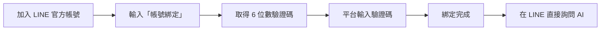

# 彰師大生輔組 獎助學金資訊平台使用手冊

> [!Note] **前言**
> 「生輔組校外獎助學金資訊平台」整合校外獎助學金資源，透過網頁、Android App、LINE 官方帳號三種介面，搭配 AI 獎學金助理，提供一站式的公告查詢、提醒訂閱與諮詢服務。
> 平台網址：<https://scholarship.ncuesa.org.tw>

> [!Tip] **開源與授權聲明**
> 本專案原始碼開源於 [**GitHub**](https://github.com/io-software-ai/NCUE-Scholarship)，僅供經國立彰化師範大學生輔組授權之開發人員存取與維護。本系統之智慧財產權（包括但不限於程式碼、設計文件及資料庫架構）屬 [**io Software**](https://iosoftware.ai) 所有。本軟體採用 **PolyForm Noncommercial License 1.0.0** 授權，允許非商業用途、個人學習及教育機構使用；未經書面許可，嚴禁任何形式之商業營利行為。詳情請參閱專案根目錄下的 [`LICENSE`](https://github.com/io-software-ai/NCUE-Scholarship?tab=License-1-ov-file) 檔案。

**目錄**
[TOC]

---

## 1. 快速開始

### 1.1 三種使用介面

| 介面 | 適合情境 | 進入方式 |
| :--- | :--- | :--- |
| **網頁版** | 完整功能，公告瀏覽、AI 助理、文件檢核、個資管理 | <https://scholarship.ncuesa.org.tw> |
| **Android App** | 隨手查看、推播提醒、離線瀏覽已載入的公告 | Google Play 下載（見 [§3.1](#31-安裝與登入)） |
| **LINE 官方帳號** | 在聊天室直接問 AI、接收公告推播 | 加入官方帳號後綁定平台帳號（見 [§4](#4-LINE-官方帳號使用說明)） |

三個介面共用同一個帳號與同一份資料：在網頁訂閱的提醒，App 與 LINE 都看得到；AI 助理的對話紀錄也會跨網頁與 LINE 同步。

### 1.2 兩種身分：彰師大學生與校外使用者

平台同時開放校內與校外使用者，登入一律使用 **Google 帳號**，首次登入時會要求選擇身分：

- **我是彰師大學生**
  - 以 `@mail.ncue.edu.tw` 或 `@gm.ncue.edu.tw` 的 Google 帳號登入 → 自動通過驗證，學號由信箱推導。
  - 以其他信箱（如 Gmail）登入 → 輸入學校信箱收取 6 位數驗證碼，驗證後自動綁定學號。
  - AI 功能由平台提供，無須自備金鑰。
- **我不是彰師大學生（校外使用者）**
  - 沒有學校信箱，改為提供**自己的 Google Gemini API 金鑰**完成註冊。
  - 註冊後可使用與校內使用者相同的功能（公告瀏覽、AI 助理、訂閱提醒、LINE 綁定等），僅無學號欄位。
  - AI 一律以你提供的金鑰呼叫，用量與費用計入你自己的 Google 帳號。

### 1.3 校外使用者：取得並設定 Gemini 金鑰

**步驟**

1. 前往 [Google AI Studio 金鑰頁面](https://aistudio.google.com/apikey)（平台畫面上也有直接連結）。
2. 使用你的 Google 帳號登入，點選 **Create API key** 建立金鑰（個人使用有免費額度）。
3. 複製 `AIza…` 開頭的字串。
4. 回到平台，貼入金鑰並選擇**儲存位置**，送出後平台會實際呼叫一次 Gemini 驗證金鑰是否可用，驗證成功即完成註冊。

**兩種儲存位置**

| 儲存位置 | 金鑰存在哪裡 | 優點 | 限制 |
| :--- | :--- | :--- | :--- |
| **存於雲端帳號**（建議） | 以 AES-256-GCM 加密後存於平台（僅伺服器可存取的資料表） | 換裝置登入即可使用；LINE 官方帳號的 AI 回覆也能運作 | 需信任平台代為保管（加密存放，不會顯示或匯出） |
| **僅存於本機裝置** | 瀏覽器 localStorage／App 安全儲存區；平台只保存末四碼遮罩提示 | 完整金鑰不離開你的裝置 | 換裝置或清除瀏覽器資料後需重新輸入；LINE 無法代為呼叫 AI |

> [!Warning] **清除金鑰＝註銷帳號**
> 校外帳號的所有功能都以金鑰為前提，因此在設定頁「清除金鑰」時，系統會提示並在你打字確認後**同時註銷帳號**（個人資料、AI 對話紀錄與訂閱一併刪除，無法復原）。你在 Google AI Studio 的金鑰本身不會被平台刪除，可自行前往撤銷。

### 1.4 註冊與登入流程

---

## 2. 網頁版使用說明

### 2.1 公告瀏覽與查詢（免登入）

- **狀態燈號**：綠色代表在申請期限內、紅色代表尚未開放或已截止，列表與詳情頁一致。
- **首頁統計燈號**：點選統計數字（如「即將截止」）可直接套用對應篩選並捲動到列表。
- **關鍵字搜尋**：可搜尋公告標題、摘要與適用對象。
- **分類篩選**：依公告分類縮小範圍，共七類。
  - A：各縣市政府獎助學金
  - B：縣市政府以外之各級公家機關及公營單位獎助學金
  - C：宗教及民間各項指定身分獎助學金
  - D：非公家機關或其他無法歸類的獎助學金
  - E：本校獲配推薦名額獎助學金
  - F：校外獎助學金得獎公告
  - G：校內獎助學金
- **狀態篩選**：全部公告／未逾期／已逾期。
- **排序**：可依申請截止日、公布日期等欄位升降排序。
- **每頁筆數**：可調整列表顯示筆數並翻頁。
- **公告詳情**：完整辦法內容、申請起訖日期、適用對象、承辦單位與附件清單。
- **附件下載**：直接下載承辦單位提供的申請辦法、申請表等檔案。
- **匯出 PDF**：將單篇公告轉為 PDF 便於列印歸檔。
- **加入 Google 日曆**：一鍵把截止日加入個人日曆。
- **公開資源頁**：「相關資源與常見問答」彙整常用外部連結（彰師大獎助學金專區、教育部圓夢助學網等）與 FAQ。

### 2.2 登入後專屬功能

- **訂閱截止提醒**：在公告詳情頁設定「截止前 N 天」提醒（1～14 天），屆期以 Email 通知；可隨時調整天數或取消。
- **AI 獎學金助理**：完整的 AI 諮詢與文件檢核功能（見 [§2.3](#23-AI-獎學金助理)）。
- **AI 背景資料（記憶庫）**：填寫一次身分別、系所年級、需求方向，之後每次對話都會自動帶入，不必重複自我介紹。
- **LINE 綁定**：綁定後可在 LINE 直接問 AI，且兩邊對話紀錄互通。
- **問題回報**：把問題與畫面截圖直接寄給承辦人員。
- **個資管理**：姓名編輯、學號狀態、訂閱與通知管理、登入紀錄、帳號註銷、AI 金鑰管理（校外使用者）。

### 2.3 AI 獎學金助理

#### 2.3.1 它能做什麼

- **查詢平台公告**：先檢索平台知識庫再回答，不憑空編造獎學金資訊。
- **推薦適合的獎學金**：依你的背景（身分別、家庭經濟狀況、成績、設籍地等）挑選可申請的公告。
- **回答制度與流程問題**：揚鷹生、弱勢助學金、兼領規定、清寒／戶籍／財產證明、成績計算等，優先查平台 FAQ。
- **文件檢核**：上傳自傳、讀書計畫、申請表，依承辦端的實際查核重點給修改建議（見 [§2.3.4](#234-文件檢核模式（自傳、計畫書、申請表）)）。
- **代為訂閱提醒**：在你確認後，替你訂閱指定公告的截止提醒。
- **整理背景資料**：徵得你同意後，把對話中提到的長期背景寫入記憶庫。
- **外部網路查詢**：只有在平台知識庫與 FAQ 都查不到時才會上網搜尋，並標註來源連結。

#### 2.3.2 回答時你會看到什麼

- **思考過程**：可展開查看 AI 的推理脈絡。
- **工具活動**：例如「搜尋知識庫：低收入戶、清寒」「確認今天日期」「閱讀網頁」，讓你知道資訊從何而來。
- **公告卡片**：回覆末端附上實際公告卡片，點擊即可開啟詳情。
- **訂閱確認按鈕**：AI 提議訂閱時出現「確認訂閱」按鈕，由你點擊才會真的訂閱。
- **記憶庫同意按鈕**：AI 提議記住某些背景時，逐項列出並等你點擊同意才寫入。
- **免責聲明**：每則回覆結尾提醒以公告原文為準。
- **回饋按鈕**：👍／👎 協助平台找出知識缺口，改善 FAQ 與知識庫。

#### 2.3.3 AI 回答一個問題的流程

#### 2.3.4 文件檢核模式（自傳、計畫書、申請表）

- **啟動方式（三種任一）**
  - 直接上傳檔案（PDF、JPG、PNG、WebP、純文字，單檔 10 MB 內）。
  - 以「@」指定要對照的公告。
  - 直接用文字問「申請書怎麼填」「為什麼被退件」「幫我看自傳」等，系統會自動切換到檢核模式。
- **檢核內容**：對照該獎學金的申請條件與承辦端查核重點，指出缺漏文件、格式問題與可修改的敘述。
- **隱私處理**：上傳的檔案**僅供當次對話使用**，抽取為文字後不保存原始檔案；對話紀錄只保留你的提問與附件檔名。

#### 2.3.5 對話管理與使用限制

- **對話紀錄**：自動保存，重新開啟頁面即接續；可一鍵清除紀錄。
- **跨渠道同步**：綁定 LINE 後，網頁與 LINE 的對話會互相作為上下文。
- **頻率限制**：每分鐘最多 10 次 AI 請求，避免濫用。
- **校外使用者的額度**：AI 用量計入你自己的 Gemini 金鑰。若金鑰失效或額度用盡，AI 會直接說明原因（例如「金鑰用量已達上限」），請到設定頁更換金鑰或於 Google AI Studio 確認額度。

> [!Warning] **免責聲明與查證義務**
> AI 回覆內容僅供參考。系統會附上資料來源（平台公告卡片或外部網站連結），**申請前請務必點擊查閱原始文件**，一切申請辦法皆依獎學金官方公告為準。

### 2.4 個資管理頁

#### 個人資料

- **姓名**：點擊姓名即可修改，離開欄位自動儲存。
- **學號**：由學校信箱自動判定，無法手動修改；校外使用者顯示「校外使用者（無學號）」，若之後取得學校信箱也可在此驗證綁定。
- **AI 背景資料**：最多 1000 字，AI 每次對話（含 LINE）都會參考；可隨時修改或清空。

#### 訂閱與通知

- **截止提醒清單**：檢視所有已訂閱公告、調整提醒天數或取消訂閱。
- **LINE 帳號綁定**：輸入 LINE 官方帳號提供的 6 位數驗證碼完成綁定，或解除綁定。

#### 帳號安全

- **AI 金鑰（校外使用者）**：顯示儲存位置與金鑰末四碼、更換金鑰或變更儲存位置、清除金鑰（同時註銷帳號）。
- **帳號狀態**：註冊時間、最後登入時間。
- **登入紀錄**：最近 10 筆登入時間與來源 IP，發現異常可立即聯繫維護團隊。
- **帳號註銷**：打字確認後永久刪除個人資料、對話紀錄與訂閱設定。

### 2.5 其他網頁功能

- **深淺色主題**：跟隨系統或手動切換。
- **PWA 安裝**：可將網站加入桌面／主畫面，離線時顯示離線頁。
- **閒置自動登出**：閒置 30 分鐘自動登出，可延長一次至 60 分鐘。
- **RSS／訂閱來源**：提供 `rss.xml` ([連結](https://scholarship.ncuesa.org.tw/rss.xml)) 供外部工具追蹤新公告。

---

## 3. Android App 使用說明

### 3.1 安裝與登入

**安裝（目前為 Google Play 測試版發布，需先取得測試資格）**

網頁版首頁的「從 Google Play 下載 App」按鈕會開啟安裝指引，共三步：

1. 加入指定的 Google 群組取得測試資格。
2. 在 Play 測試頁點選「**成為測試人員（Become a tester）**」。
3. 畫面顯示「您已成為測試人員」後，點連結跳轉 Play 商店安裝頁安裝。

> [!Warning] **帳號一致**
> 請確保瀏覽器登入的 Google 帳號與手機 Google Play 商店登入的帳號是同一個，否則會看不到安裝頁面。

- **登入**：使用 Google 帳號一鍵登入；首次登入同樣需完成身分選擇（彰師大學生驗證或校外自備金鑰，見 [§1.2](#12-兩種身分：彰師大學生與校外使用者)、[§1.3](#13-校外使用者：取得並設定-Gemini-金鑰)）。
- **校外使用者**：金鑰選擇「僅存於這台裝置」時會寫入手機安全儲存區（iOS Keychain／Android Keystore）；換手機需重新輸入，或改選「存於雲端帳號」。

### 3.2 四個分頁

#### 公告

- 左右滑動即可換頁，底部膠囊指示器即時跟隨。
- 公告列表支援搜尋、分類與截止狀態標示。
- **本機收藏**：收藏感興趣的公告（存在手機，不上傳）。
- **已讀標記**：看過的公告會標示，方便辨識新公告。
- **搜尋歷史**：保留最近搜尋詞，可單筆刪除或全部清除。
- **附件開啟／分享**：以系統檢視器開啟附件，或分享給他人。

#### 助理

- 與網頁版同一個 AI 獎學金助理，功能一致：思考過程、工具活動、公告卡片、訂閱與記憶庫同意卡。
- 支援上傳文件進行檢核（文件選擇器）。
- 可中止生成（「停止生成」）、重新生成上一則回覆、複製回覆內容。
- 若這台裝置找不到你的金鑰，AI 會直接說明並引導你到設定頁重新輸入。

#### 通知

- 檢視訂閱的公告與提醒狀態。
- **推播權限**：可在此開啟系統推播權限，接收公告與截止提醒。

#### 設定

- **LINE 帳號綁定**：與網頁版相同的 6 位數驗證碼流程。
- **AI 金鑰（校外使用者）**：顯示儲存位置與末四碼、更換金鑰／變更儲存位置、清除金鑰（同時註銷帳號）。
- **訂閱與通知管理**、**常見問題 FAQ**、**服務條款與隱私權**、**問題回報**。
- **外觀主題**：跟隨系統／淺色／深色。
- **登出與刪除帳號**：刪除帳號需打字確認。

### 3.3 其他 App 特性

- **App 圖示長按捷徑**：可直接跳到「助理」分頁。
- **深連結**：從通知或連結開啟時會導向對應公告或分頁。
- **離線容錯**：已載入的公告資料會快取，網路不穩時仍可瀏覽先前內容。

---

## 4. LINE 官方帳號使用說明

### 4.1 加入與綁定

1. 加入平台 LINE 官方帳號好友（網頁「個資管理 → 訂閱與通知」有加入按鈕）。
2. 在聊天室點下方選單「**帳號綁定**」，或直接輸入「帳號綁定」。
3. 官方帳號回覆一組 **6 位數驗證碼**（10 分鐘內有效）。
4. 回到平台「個資管理 → 訂閱與通知 → LINE 帳號綁定」（App 為「設定 → LINE 帳號綁定」）輸入驗證碼。
5. 綁定完成，即可在 LINE 直接詢問 AI 獎學金助理。

### 4.2 綁定後可以做什麼

- **AI 問答**：直接輸入問題，例如
  - 最近有哪些獎學金可以申請？
  - 低收入戶可以申請什麼獎學金？
  - ○○獎學金的截止日期是什麼時候？
- **跨渠道記憶**：LINE 與網頁的對話互為上下文，不必重複說明背景。
- **公告推播**：接收管理員發送的重要公告訊息。
- **訂閱截止提醒**：在對話中以文字明確同意後，AI 可代為訂閱指定公告的提醒。

### 4.3 LINE 端的限制

- 回覆為**純文字**（不支援粗體、表格等排版），詳細內容請點訊息中的平台連結查看。
- AI 回覆有每分鐘次數限制，短時間連續發問可能需稍候。
- 未綁定帳號時，官方帳號會先引導完成綁定。
- **校外使用者請注意**：金鑰選擇「僅存於本機裝置」時，LINE 這端沒有你的裝置可附帶金鑰，AI 無法回覆；系統會提示你改為「儲存到雲端帳號」後即可在 LINE 使用。
- 解除綁定後，LINE 對話即不再與平台帳號關聯。

---

## 5. 管理員頁面功能說明

管理員登入後可於右上角進入「管理後台」（`/manage`），共七個分頁。

### 5.1 公告管理

- **建立／編輯公告**：使用 TinyMCE 進階編輯器（支援 HTML 排版）。
- **狀態控制**：上架／下架（下架後前台不顯示，亦會自動從 AI 知識庫移除）。
- **複製公告**：以現有公告為範本快速建立新公告。
- **附件管理**：單篇最多 8 個附件、單檔上限 15 MB，可拖曳調整順序。
- **AI 輔助生成**：上傳辦法檔案或提供網址，由 AI 分析後自動填寫欄位草稿。
- **知識庫同步**：公告建立／更新時即整理為 AI 易讀內容寫入知識庫；可手動檢視或重新同步。
- **重複檢查**：建立時提示可能重複的既有公告。
- **Email 推播**：公告發布後可將該則公告轉為 HTML 信件寄給使用者。

> [!Note] **TinyMCE 額度**
> 目前使用免費方案，每月有編輯器載入次數上限。若編輯器鎖定並顯示錯誤，請至 [Tiny Cloud](https://www.tiny.cloud/) 申請新的 API Key，並於「系統設定」更新金鑰。

> [!Warning] **附件檔名規範**
> 使用者下載時僅能透過檔名辨識內容，上傳前務必修改檔名。
> - ✅ `113學年度申請辦法.pdf`、`xxx申請表.pdf`
> - ❌ `scan_20240101.pdf`、`attachment1.pdf`　

> [!Note] **AI 生成可讀取的格式**
> - ✅ 可分析：PDF（文字型）、JPG、PNG
> - ❌ 不可分析但可作為附件：Word、Excel 等。
> 
> 提供網址時，AI 僅能讀取該網頁的文字內容，**無法**讀取網頁內的附件檔案；若辦法在附件中，請下載後改用檔案上傳。

### 5.2 使用者管理

- **帳號清單**：學號、姓名、Email（脫敏顯示）、權限、註冊時間、Google 登入標示。
- **校外使用者標註**：無學號的校外帳號在學號欄位顯示「**校外**」標籤，滑鼠停留可看到金鑰儲存位置（雲端／僅存於其裝置），便於排查 AI 問題。
- **搜尋與篩選**：可依姓名、學號、Email 搜尋，並依權限篩選。
- **權限調整**：一鍵設為管理員／使用者。
- **個別通知**：對單一使用者寄送通知信。
- **刪除帳號**：由管理員刪除指定帳號。

### 5.3 匯出與統計

- **瀏覽數趨勢圖**：可切換日／週／月檢視流量變化。
- **統計摘要**：總瀏覽量、逾期公告數等。
- **CSV 匯出**：勾選公告（可全選）後匯出報表，含標題、摘要、瀏覽數等欄位。
- **批次刪除**：批次勾選並清理過期公告。
- **單篇 PDF 下載**：將公告轉為正式 PDF 便於列印歸檔。

### 5.4 LINE 管理

- **好友清單**：檢視加入官方帳號的使用者、綁定狀態與最後訊息時間，可置頂重要對話。
- **對話紀錄**：檢視使用者與 AI／管理員的訊息往來。
- **手動回覆／推送**：以官方帳號名義發送訊息。
- **帳號綁定協助**：查詢並協助使用者完成綁定。
- **圖文選單（Rich Menu）**：上傳與套用官方帳號下方選單圖片。

### 5.5 常見問題（FAQ）

- **FAQ 維護**：以區塊編輯器新增、編輯、排序前台常見問答（受控樣式，確保版面一致）。
- **AI 連動**：FAQ 內容同時作為 AI 助理回答制度類問題的優先依據。

### 5.6 AI 品質（知識缺口）

- **知識缺口分析**：彙整 AI 回答不佳或使用者按 👎 的對話，找出知識庫缺漏的主題。
- **FAQ 草稿審核**：由分析結果產生 FAQ 草稿，管理員審核後發布。
- **評估為手動觸發**：需管理員主動執行分析（採增量方式，不會重複評估已處理的對話）。

### 5.7 系統設定

- **API 金鑰管理**：Gemini API 金鑰（平台共用）、SerpApi 金鑰（外部搜尋）、TinyMCE 金鑰等，皆存於伺服器端。
- **AI 助理開關**：可暫時停用全站 AI 助理（例如額度用盡或維護期間）。
- **郵件與系統參數**：寄件者資訊等平台設定。
- **系統用量監控**：檢視資源使用狀況。

> [!Note] **平台 Gemini 額度**
> 平台共用金鑰有每日／每分鐘請求上限。若提示額度已達上限，可至 [Google AI Studio](https://aistudio.google.com/apikey) 申請新金鑰（必要時綁定帳單），於「系統設定」更新後即恢復。
> 校外使用者使用自己的金鑰，不佔用平台額度。

---

## 6. 常見問題排解

| 狀況 | 可能原因與處理 |
| :--- | :--- |
| 登入後被要求「選擇身分」 | 首次登入須完成驗證：校內信箱自動通過、其他信箱請驗證學校信箱，或以自備 Gemini 金鑰註冊為校外使用者。 |
| 學校信箱收不到驗證碼 | 檢查垃圾信件匣；驗證碼 10 分鐘有效，逾時請重新寄送。同一學號不得被兩個帳號綁定。 |
| AI 回覆「金鑰已失效或無權限」 | 校外使用者的金鑰被撤銷或未啟用 Gemini API，請於 Google AI Studio 重新產生後在設定頁更新。 |
| AI 回覆「用量已達上限」 | 你的 Gemini 金鑰額度用盡，稍後再試或於 Google AI Studio 確認額度與帳單設定。 |
| 換手機後 AI 無法使用 | 金鑰選擇「僅存於本機裝置」時不會跟著帳號移動，請重新輸入，或改選「存於雲端帳號」。 |
| LINE 問 AI 沒有回覆 | 確認已完成帳號綁定；校外使用者若把金鑰只存在本機，需改為儲存到雲端帳號。 |
| 公告內容與附件不一致 | 一律以承辦單位公告與附件原文為準，並可透過問題回報通知平台更正。 |

---

## 7. 聯繫窗口與支援

| 業務類型 | 聯繫對象 | Email | 備註 |
| :--- | :--- | :--- | :--- |
| **獎學金業務問題** | 生輔組 何淑芬 | ==[act5718@gmail.com](mailto:act5718@gmail.com)== | 申請資格、期限、繳件方式等問題 |
| **平台技術問題** | 開發團隊窗口 [陳泰銘](https://iosoftware.ai) | ==[contact@iosoftware.ai](mailto:contact@iosoftware.ai)== | 網站故障、帳號異常、功能建議 |
